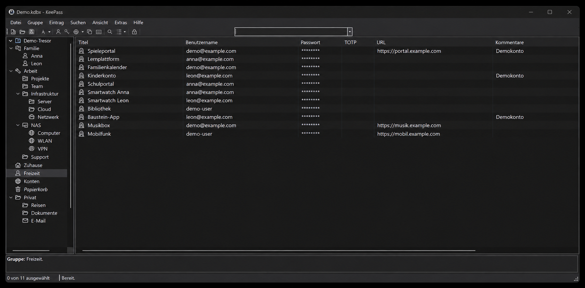
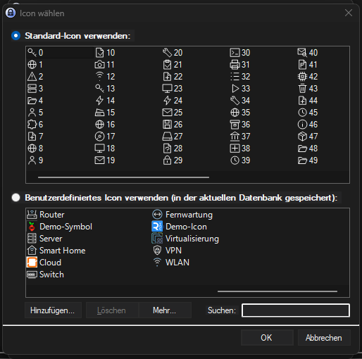

# KeeTheme Modern Dark

Ein KeeTheme-Fork für KeePass 2 mit dunkler Oberfläche, einheitlichen Standardicons und einer aufgeräumten Symbolleiste.

Bearbeitete Originalansicht mit ausschließlich fiktiven Ordnernamen, Einträgen und Zugangsdaten.

Die Standardicons erscheinen im modernen Stil. Eigene Datenbankicons bleiben erhalten; die abgebildeten Namen wurden durch neutrale Demo-Bezeichnungen ersetzt.

## Funktionen

- Modern Dark mit dunklen Panels und Menüs sowie hellen Texten.
- Einheitliche Icons in Symbolleiste, Gruppenbaum, Eintragsliste und Icon-Auswahl.
- Breiteres Suchfeld, bei ausreichendem Platz mittig angeordnet.
- Dunklere Zeilen und abschaltbare Spaltentrennlinien, auch in gruppierten Suchergebnissen.
- Originales KeePass-Fensterlogo in Graustufen.
- Moderne Icon-Vorschau und Passwortgenerator-Symbole im Eintragsdialog.

Die vorhandenen KeeTheme-Themes und Funktionen bleiben verfügbar. Passwort- und KDBX-Logik werden nicht verändert.

## Installation und Einstellungen

[Installation, Build-Anleitung, Prüfungen und Plugin-Grenzen](docs/ModernDark.md).

Die aktuelle Version aus diesem Fork bauen und KeeTheme.dll in den KeePass-Plugins-Ordner kopieren. Vor dem Austausch KeePass schließen und vorherige KeeTheme.dll/KeeTheme.plgx sichern und aus dem Plugins-Ordner nehmen. Unter **Extras → Optionen → KeeTheme** das Theme **Modern Dark** auswählen.

Der Eintragsdialog-Fix ist gebaut und automatisiert geprüft; die Bestätigung im laufenden KeePass steht noch aus.

## Ursprung

Dieser Fork basiert auf [xatupal/KeeTheme](https://github.com/xatupal/KeeTheme). KeeTheme-Lizenz: [MIT](LICENSE). Das originale KeePass-Logo stammt aus KeePass; Quellenhinweise stehen in der Dokumentation.